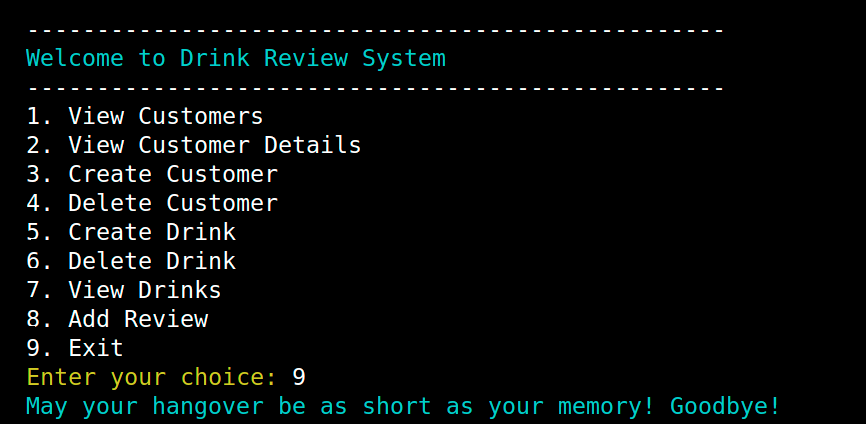

# Drink Review System

A simple system for managing customers, drinks, and reviews.

## Description

This project provides a command-line interface (CLI) for interacting with a database containing information about customers, drinks, and their reviews. It allows users to perform various actions such as viewing customers, adding customers, deleting customers, adding drinks, deleting drinks, viewing drinks, and adding reviews.



## Requirements

- Python 3.x
- SQLAlchemy
- Faker
- Tabulate
- Colorama
- alembic

## Installation

1. Clone the repository:
    Through SSH:

    ```bash
    git clone git@github.com:John-thabuks/sip_spot.git
    ```

2. Install dependencies:
    The dependency file is named thabuks.txt:

    ```bash
    pip install -r thabuks.txt
    ```

## Usage

1. Run the `main.py` file:

    ```bash
    python main.py
    ```

2. Follow the instructions provided in the CLI to perform various actions.

    

## Database

The project uses an SQLite database named `member_club.db` located in the `db` directory.
The project used the extention `DevDb` for GUI visualization

### Tables

- `customers`: Stores information about customers.
- `drinks`: Stores information about drinks.
- `reviews`: Stores reviews provided by customers for drinks.
- `customer_drinks`: Represents a many-to-many relationship between customers and drinks.

## File Structure

- `main.py`: Contains the main CLI interface and functionality.
- `models.py`: Defines SQLAlchemy models for database tables.
- `seeds.py`: Contains functions to seed the database with fake data.
- `README.md`: Documentation file (you are here).

## Contributing

Contributions are welcome! Please feel free to open issues or pull requests for any improvements or features you'd like to add.

## License

This project is licensed under the MIT License. See the [License John Muthabuku](https://github.com/John-thabuks/sip_spot) file for details.
